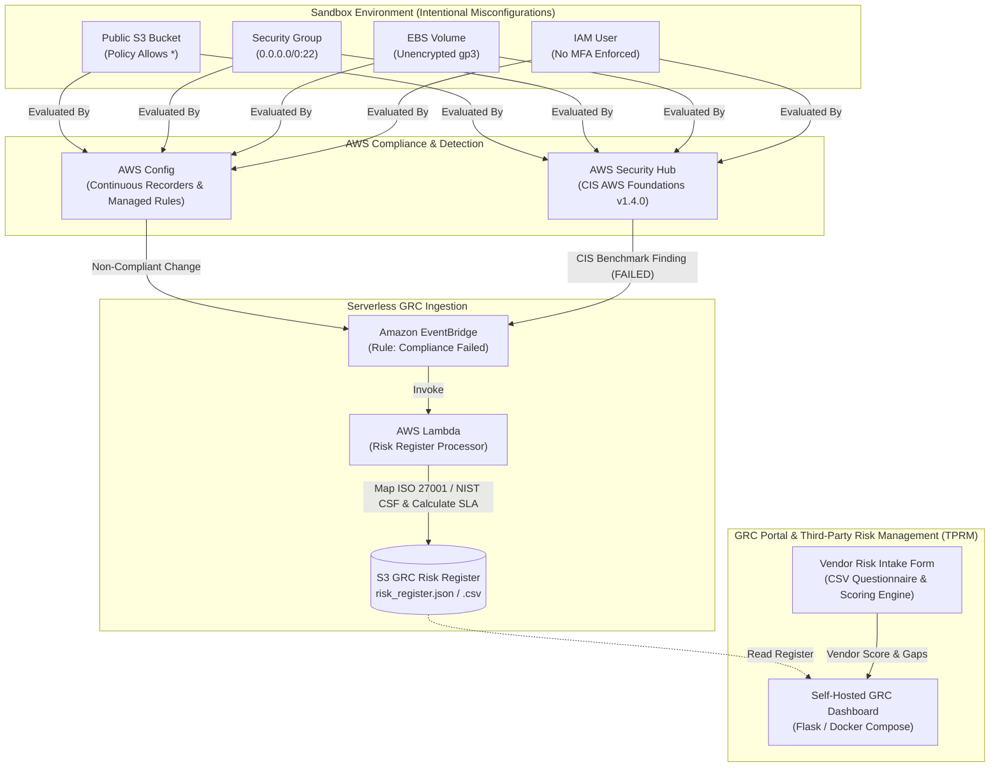

# Cloud Compliance & Vendor Risk Management Lab

[](https://www.terraform.io/)
[](https://aws.amazon.com/security-hub/)
[](https://aws.amazon.com/config/)
[](#compliance-framework-crosswalk)

An enterprise-grade Infrastructure-as-Code (IaC) security governance and Third-Party Risk Management (TPRM) lab. This repository provisions continuous compliance auditing across AWS using **AWS Config** and **AWS Security Hub** (CIS AWS Foundations Benchmark v1.4.0), automatically ingests failed controls via **Amazon EventBridge** and **AWS Lambda**, enriches them with **ISO 27001:2022** and **NIST CSF v2.0** control crosswalks, updates a live GRC Risk Register (JSON/CSV), and simulates an end-to-end Vendor Risk Assessment scoring engine.

---

## 🏛️ Architecture Overview

The solution consists of four primary subsystems:
1. **Continuous Audit Engine:** AWS Config rules and Security Hub CIS Benchmark standard evaluating AWS resources in real time.
2. **Intentional Sandbox Vulnerabilities:** Controlled demo resources violating CIS benchmarks (public S3, open port 22, unencrypted EBS, IAM user without MFA).
3. **Automated Risk Register Pipeline:** EventBridge rule filtering non-compliant events and invoking a Python Lambda handler that maps findings to ISO 27001 Annex A & NIST CSF, calculates remediation SLAs, and writes to an S3 Risk Register.
4. **Vendor Risk Intake & Scoring:** Standardized TPRM questionnaire, weighted scoring engine, and self-hosted GRC risk dashboard.



---

## 📋 Compliance Framework Crosswalk

| Misconfigured Demo Resource | CIS AWS v1.4.0 Control | ISO/IEC 27001:2022 | NIST CSF v2.0 | Threat & Exposure Vector |
| :--- | :--- | :--- | :--- | :--- |
| **Public S3 Bucket** | `2.1.5` Prohibit Public Read | **A.5.15** Access Control<br>**A.8.24** Cryptography | `PR.AC-3`, `PR.DS-1` | Data exfiltration, accidental disclosure of confidential assets |
| **Open Security Group (Port 22)** | `5.2` Disallow 0.0.0.0/0:22 | **A.8.20** Network Security<br>**A.8.21** Network Services | `PR.AC-5`, `PR.PT-4` | Automated SSH brute-force guessing, credential spraying |
| **Unencrypted EBS Volume** | `2.2.1` EBS Encryption Enabled | **A.8.24** Use of Cryptography | `PR.DS-1` | Data at rest exposure if disk snapshot shared or volume detached |
| **IAM User without MFA** | `1.5` MFA for Console Users | **A.5.17** Authentication Info<br>**A.5.15** Access Control | `PR.AC-1`, `PR.AC-7` | Credential stuffing leading to privilege escalation and compromise |

*See full mapping documentation in [`docs/COMPLIANCE_CONTROL_MAPPING.md`](docs/COMPLIANCE_CONTROL_MAPPING.md).*

---

## 🚀 Getting Started & Deployment

### Prerequisites
- [AWS CLI v2](https://docs.aws.amazon.com/cli/latest/userguide/install-cliv2.html) configured with active credentials (`aws sts get-caller-identity`).
- [Terraform >= 1.5.0](https://www.terraform.io/downloads.html).
- Python 3.10+ (for local vendor risk evaluation).
- Docker & Docker Compose (optional, for self-hosted GRC dashboard).

### Step 1: Clone Repository
```bash
git clone https://github.com/SannidhiSriram-06/cloud-compliance-vendor-risk.git
cd cloud-compliance-vendor-risk
```

### Step 2: Configure & Deploy Infrastructure
```bash
cd terraform
cp terraform.tfvars.example terraform.tfvars

# Review or customize variables (e.g. aws_region)
terraform init
terraform plan
terraform apply -auto-approve
```

Upon completion, Terraform outputs will show:
- `risk_register_s3_bucket`: S3 bucket storing live risk register outputs
- `lambda_function_name`: Risk Register Logger processor
- `vulnerable_resources`: Resource IDs of demo misconfigured assets

### Step 3: Trigger Findings & Ingestion
AWS Config and Security Hub will evaluate the resources within 5 to 15 minutes. To simulate or test the Lambda ingestion pipeline immediately without waiting on AWS scan schedules:
```bash
# Test Lambda logic locally
python3 ../lambda/risk_register_processor.py

# Or invoke the deployed Lambda using AWS CLI with the provided test event
aws lambda invoke \
  --function-name $(terraform output -raw lambda_function_name) \
  --payload fileb://../lambda/test_event.json \
  response.json
```

### Step 4: Run Third-Party Vendor Risk Assessment (TPRM)
Evaluate vendor security compliance against our standardized intake questions:
```bash
cd ../vendor-risk

# Execute vendor risk assessment and scoring engine
python3 vendor_risk_assessment.py --vendor "Apex Cloud Analytics Inc."
```
Outputs:
- Executive assessment report: `sample_vendor_report.md`
- Machine-readable risk audit: `sample_vendor_assessment.json`

### Step 5: (Optional) Launch Self-Hosted GRC Dashboard
Visualize the live risk register, control mappings, SLAs, and vendor scores in a local web interface:
```bash
cd ../grc
docker compose up -d
```
Access the GRC portal in your browser at `http://localhost:8080`.

---

## 📸 Screenshots & Evidence

> *Placeholder section: Capture and attach screenshots of your sandbox audit findings.*

| Component | Description | Evidence Placeholder |
| :--- | :--- | :--- |
| **AWS Security Hub CIS Findings** | Summary of CIS Benchmark evaluations and failed controls | `` |
| **AWS Config Non-Compliant Rules** | AWS Config timeline highlighting non-compliant S3 & SG resources | `` |
| **Risk Register Output (S3 CSV/JSON)** | Structured risk log enriched with ISO 27001 and NIST CSF IDs | `` |
| **Vendor Risk Scorecard** | Breakdown of TPRM category scores and residual risk tier | `` |

---

## 💰 Cost Notes

- **AWS Security Hub:** Includes a **30-day free trial** for new accounts.
- **AWS Config:** Includes free tier recorder usage; each configuration item evaluation costs approximately $0.003. Total expected cost for running this demo in a sandbox is **a few cents ($0.05 - $0.20)**.
- **AWS Lambda & EventBridge:** Well within the AWS Always-Free Tier (1M free requests/month).
- **Amazon S3:** Micro-usage (< 1 MB), pennies per month.

---

## 🧹 How to Destroy (Teardown)

To avoid incurring ongoing charges for AWS Config recording or demo storage:

```bash
cd terraform

# Destroy all provisioned resources
terraform destroy -auto-approve
```

> [!IMPORTANT]
> Verify in the AWS Console that the S3 config and risk register buckets were cleaned up. The buckets are configured with `force_destroy = true` for clean teardown.
