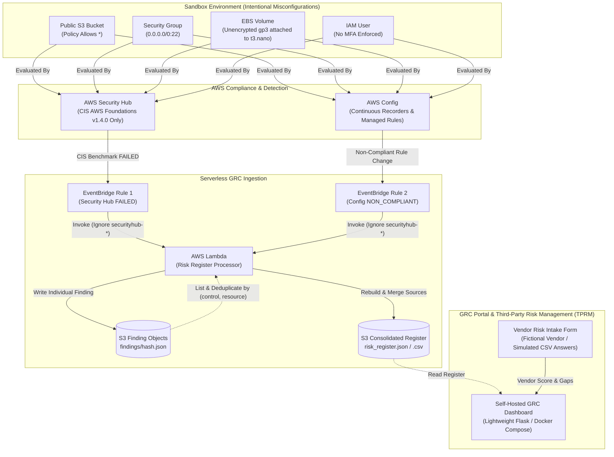

# Cloud Compliance & Vendor Risk Management Lab

[](https://www.terraform.io/)
[](https://aws.amazon.com/security-hub/)
[](https://aws.amazon.com/config/)
[](#compliance-framework-crosswalk)

An enterprise-grade Infrastructure-as-Code (IaC) security governance and Third-Party Risk Management (TPRM) lab. This repository provisions continuous compliance auditing across AWS using **AWS Config** and **AWS Security Hub** (CIS AWS Foundations Benchmark v1.4.0 only), automatically ingests failed controls via **Amazon EventBridge** and **AWS Lambda**, enriches them with **ISO 27001:2022** and **NIST CSF v1.1** control crosswalks, updates a live GRC Risk Register (JSON/CSV), and simulates an end-to-end Vendor Risk Assessment scoring engine.

---

## 🏛️ Architecture Overview

The solution consists of four primary subsystems:
1. **Continuous Audit Engine:** AWS Config rules and Security Hub CIS Benchmark standard (CIS v1.4.0 only; AWS Foundational Security Best Practices was removed to focus purely on the CIS benchmark) evaluating AWS resources in real time.
2. **Intentional Sandbox Vulnerabilities:** Controlled demo resources violating CIS benchmarks (public S3 bucket, open port 22 security group, unencrypted EBS gp3 volume attached to an Amazon Linux 2023 `t3.nano` EC2 instance, IAM user without MFA).
3. **Automated Risk Register Pipeline:** Two EventBridge rules capture non-compliant events (Security Hub FAILED findings; Config NON_COMPLIANT evaluations). Event emissions from Security Hub-managed Config rules (`securityhub-*`) are automatically ignored to avoid duplication. The Python Lambda writes individual finding objects under `findings/<hash>.json` and dynamically rebuilds consolidated `risk_register.json` and `risk_register.csv` files via S3 listing. Deduplication merges findings by `(control, resource)` key into a combined `Sources` list (`AWS Config` and/or `AWS Security Hub`). Reserved concurrency is intentionally unconfigured due to the sandbox default limit of 10 concurrent executions.
4. **Vendor Risk Intake & Scoring:** Standardized TPRM questionnaire, weighted scoring engine, and self-hosted GRC risk dashboard (lightweight self-built Flask demonstration app, not a commercial GRC product).



---

## 📋 Compliance Framework Crosswalk & Provenance

To maintain audit honesty and defensibility, risk register columns are partitioned into **AWS-Sourced Telemetry** (ground truth from live scanners) and **Analyst-Assigned Classifications** (indicative crosswalks and governance metadata):
- **CIS Controls & Severity:** Sourced directly from AWS Security Hub (`Compliance.RelatedRequirements`) and AWS Config.
- **ISO 27001:2022 & NIST CSF v1.1:** Hand-built indicative crosswalks (`ISO_NIST_Basis = "analyst-assigned (indicative)"`).
- **Owner & SLA:** Organizationally assigned governance metadata based on severity matrix.
- **Unmapped Controls:** Non-benchmark telemetry (such as CIS Section 4 CloudWatch metric filters) is captured with `ControlMapping = "UNMAPPED"` and `CIS_Match = "none"`. In our live execution, 21 total findings were recorded (17 mapped, 4 unmapped).

| Misconfigured Demo Resource | CIS AWS v1.4.0 Control | CIS_Match | ISO/IEC 27001:2022 | NIST CSF v1.1 | Threat & Exposure Vector |
| :--- | :--- | :---: | :--- | :--- | :--- |
| **Public S3 Bucket** | `2.1.5` Prohibit Public Read | `exact` | **A.5.15** Access Control<br>**A.8.24** Cryptography | `PR.AC-3`, `PR.DS-1` | Data exfiltration, accidental disclosure of confidential assets |
| **Open Security Group (Port 22)** | `5.2` Disallow 0.0.0.0/0:22 | `exact` | **A.8.20** Network Security<br>**A.8.21** Network Services | `PR.AC-5`, `PR.PT-4` | Automated SSH brute-force guessing, credential spraying *(Flagged by Config only)* |
| **Unencrypted EBS Volume** | `2.2.1` EBS Encryption Enabled | `closest` | **A.8.24** Use of Cryptography | `PR.DS-1` | Plaintext volume exposure if detached or shared *(Attached to t3.nano instance)* |
| **IAM User without MFA** | `1.10` MFA for Console Users | `exact` | **A.5.17** Authentication Info<br>**A.5.15** Access Control | `PR.AC-1`, `PR.AC-7` | Credential stuffing leading to privilege escalation *(Mapped to CIS 1.10)* |

*See full mapping documentation and provenance glossary in [`docs/COMPLIANCE_CONTROL_MAPPING.md`](docs/COMPLIANCE_CONTROL_MAPPING.md).*

---

## 🚀 Getting Started & Deployment

### Prerequisites
- [AWS CLI v2](https://docs.aws.amazon.com/cli/latest/userguide/install-cliv2.html) configured with active credentials (`aws sts get-caller-identity`).
- [Terraform >= 1.5.0](https://www.terraform.io/downloads.html).
- Python 3.10+ (for local vendor risk evaluation).
- Docker & Docker Compose (for the self-hosted demonstration GRC dashboard).

### Step 1: Clone Repository
```bash
git clone https://github.com/SannidhiSriram-06/cloud-compliance-vendor-risk.git
cd cloud-compliance-vendor-risk
```

### Step 2: Configure & Deploy Infrastructure
```bash
cd terraform
cp terraform.tfvars.example terraform.tfvars

# Review or customize variables (e.g. aws_region)
terraform init
terraform plan
terraform apply
```

Upon completion, Terraform outputs will show:
- `risk_register_s3_bucket`: S3 bucket storing live risk register outputs
- `lambda_function_name`: Risk Register Logger processor
- `vulnerable_resources`: Resource IDs of demo misconfigured assets

### Step 3: Trigger Findings & Ingestion
AWS Config and Security Hub will evaluate the resources within 5 to 15 minutes. The Lambda processor triggers automatically via EventBridge when findings are published.

### Step 4: Run Third-Party Vendor Risk Assessment (TPRM)
Evaluate vendor security compliance using the CLI assessment engine:
```bash
cd ../vendor-risk

# Execute vendor risk assessment and scoring engine (Evaluates fictional vendor with simulated answers)
python3 vendor_risk_assessment.py --vendor "Apex Cloud Analytics Inc."
```
Outputs:
- Executive assessment report: `sample_vendor_report.md`
- Machine-readable risk audit: `sample_vendor_assessment.json`

### Step 5: Launch Self-Hosted GRC Dashboard
Visualize the live risk register, control mappings, SLAs, and vendor scores in a local web interface:
```bash
cd ../grc
docker compose up -d
```
Access the demonstration GRC portal in your browser at `http://localhost:8080`.

---

## 💡 Known Limitations & Lessons Learned

- **AWS Free Plan Subscription Constraint:** Security Hub cannot be enabled on an AWS account operating under the default AWS Free Plan without an active payment method on file, returning `SubscriptionRequiredException`. Upgrading the sandbox account to a standard paid tier resolves this immediately.
- **EBS Rule Evaluation Mechanism:** AWS Config rule `encrypted-volumes` evaluates only volumes that are actively **attached** to an EC2 instance. Standalone detached volumes remain in `NOT_APPLICABLE` state. In this architecture, a small `t3.nano` Amazon Linux 2023 instance (`demo_host`) is provisioned to host the volume attachment.
- **Security Group Detection Sourcing:** In our live execution, the unrestricted port 22 security group was flagged by AWS Config's `restricted-ssh` managed rule; Security Hub did not emit a corresponding finding during the run window.
- **Lambda Concurrency in New Sandbox Accounts:** Standard AWS sandbox accounts have an initial regional Lambda concurrency limit of 10. Specifying `reserved_concurrent_executions` can exhaust available capacity; this deployment relies on default shared unreserved concurrency.
- **Security Hub-Managed Config Rules:** When Security Hub standards are enabled, AWS automatically creates managed Config rules prefixed with `securityhub-*`. The Lambda processor filters out these rule events to prevent duplicate processing of Config events already represented via Security Hub ASFF findings.

---

## 💰 Cost Notes

- **AWS Security Hub:** Includes a **30-day free trial** for new accounts.
- **AWS Config:** Includes free tier recorder usage; each configuration item evaluation costs approximately $0.003. Total expected cost for running this demo in a sandbox is **a few cents ($0.05 - $0.20)**.
- **AWS EC2 & EBS:** `t3.nano` demo host and 1 GiB gp3 volume incur negligible compute costs (< $0.05 for several hours).
- **AWS Lambda & EventBridge:** Well within the AWS Always-Free Tier (1M free requests/month).
- **Amazon S3:** Micro-usage (< 1 MB), pennies per month.

---

## 🧹 How to Destroy (Teardown)

To avoid recurring charges after demonstration sessions:

```bash
cd terraform

# Destroy all provisioned resources
terraform destroy
```

All demo S3 buckets include `force_destroy = true` to ensure clean deletion during teardown.
